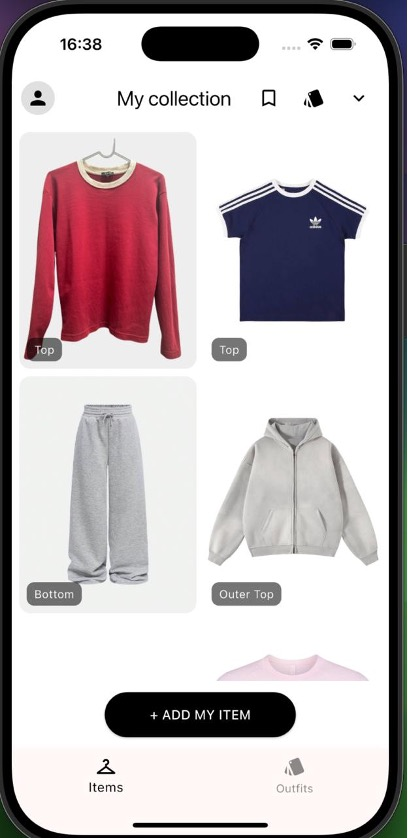
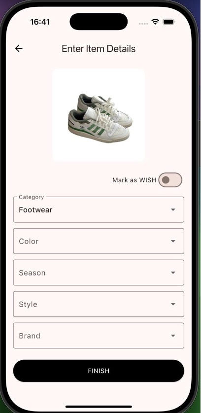
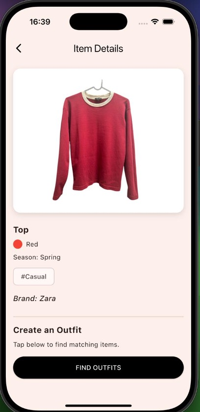
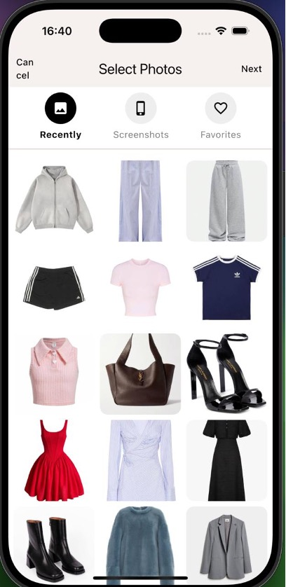
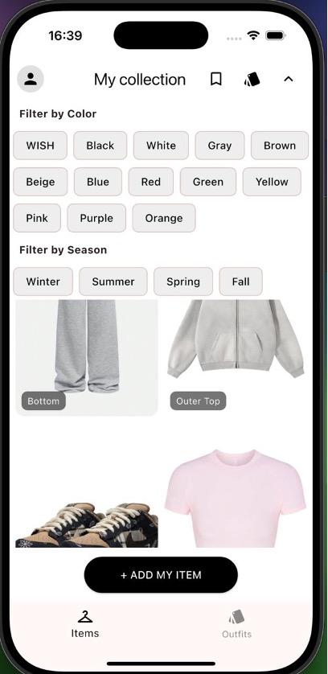
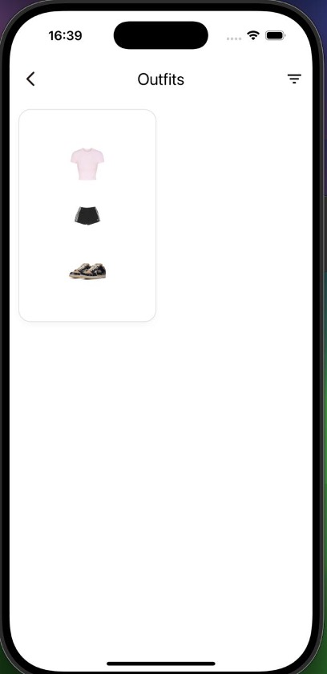
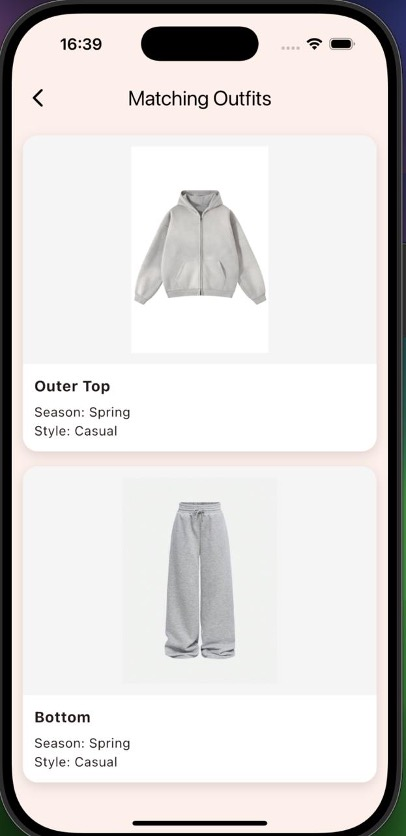
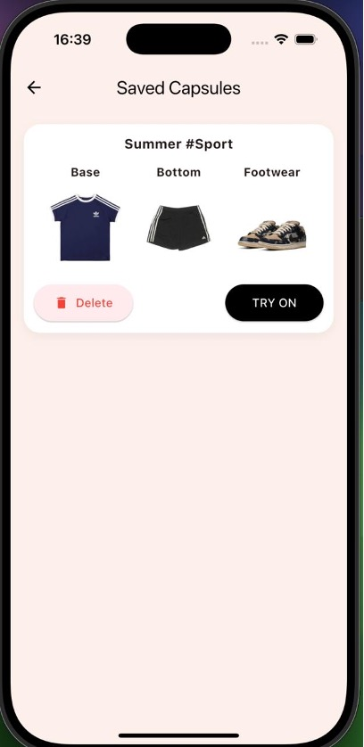

# getoutfitsapp

A Flutter-based mobile application for wardrobe management and outfit suggestions.

[](https://flutter.dev/) [](https://firebase.google.com/) [](#)

---

## Description

**getoutfitsapp** is a cross-platform mobile application built with Flutter that enables users to manage their wardrobe, store clothing items, and receive intelligent outfit suggestions. The app provides a comprehensive solution for organizing your personal style and making daily outfit decisions easier.

---

## Features

- **Onboarding Flow**: Guided introduction for new users
- **Authentication**: Secure user registration and login using Firebase Authentication
- **Closet Management**: Add, view, and edit clothing items with detailed information
- **Item Details**: Comprehensive view of individual wardrobe items
- **Outfit Finder**: AI-powered outfit matching and suggestions
- **Try-On Screen**: Visual preview of outfit combinations
- **Saved Capsules**: Store and manage favorite outfit combinations
- **User Profile**: Personal account management
- **Cross-Platform**: Native performance on both Android and iOS

---

## Screenshots

<p align="center">
  
  
  
  
  
  
  
  
</p>

<p align="center">
  <b>Main Menu</b> &nbsp; | &nbsp;
  <b>Select</b> &nbsp; | &nbsp;
  <b>Enter Item</b> &nbsp; | &nbsp;
  <b>Item Detail</b> &nbsp; | &nbsp;
  <b>Sort</b> &nbsp; | &nbsp;
  <b>Outfits</b> &nbsp; | &nbsp;
  <b>Match Outfits</b> &nbsp; | &nbsp;
  <b>Saved Capsules</b>
</p>

---

## Tech Stack

- **Flutter** (Dart) - Cross-platform UI framework
- **Firebase** - Backend services:
  - Authentication for user management
  - Firestore for data persistence
  - Storage for image assets
- **Custom Assets** - Custom icons and images
- **Platform Integration** - Native Android and iOS support

---

## Getting Started

### Prerequisites

- Flutter SDK (3.0 or higher)
- Dart SDK
- Android Studio / Xcode (for platform-specific development)
- Firebase project configured

### Installation

1. Clone the repository:
   ```sh
   git clone https://github.com/25angel/getoutfitsapp.git
   cd getoutfitsapp
   ```

2. Install dependencies:
   ```sh
   flutter pub get
   ```

3. Configure Firebase:
   - Add your `google-services.json` (Android) and `GoogleService-Info.plist` (iOS) files
   - Update Firebase configuration in your project

4. Run the application:
   ```sh
   flutter run
   ```

### Building for Production

**Android:**
```sh
flutter build apk --release
# or
flutter build appbundle --release
```

**iOS:**
```sh
flutter build ios --release
```

---

## Project Structure

```
lib/
├── main.dart                 # Application entry point
├── models/                   # Data models
│   └── item_model.dart
└── views/                    # UI screens and widgets
    ├── add_item_screen.dart
    ├── add_item_details_screen.dart
    ├── closet_screen.dart
    ├── find_outfits_screen.dart
    ├── image_service.dart
    ├── item_detail_screen.dart
    ├── login_screen.dart
    ├── onboarding_screen.dart
    ├── outfit_detail_screen.dart
    ├── outfits_screen.dart
    ├── profile_screen.dart
    ├── saved_capsuled_screen.dart
    └── try_on_screen.dart
```

---

## Author

- **Victor**
- Telegram: [@svnteenmart](https://t.me/svnteenmart)
- GitHub: [25angel](https://github.com/25angel)

---

_Made with Flutter & Firebase_
